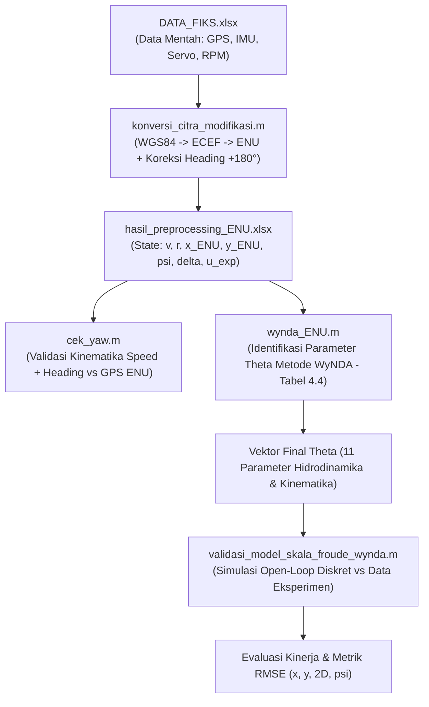

# Pemodelan Matematika & Validasi Kapal USV Metode WyNDA (11 Parameter)
## Spesifikasi Skala Froude (1:100) — Koordinat Local ENU

Repositori/folder ini berisi implementasi lengkap pra-pengolahan data eksperimen maritim, kalibrasi sensor orientasi, identifikasi parameter hidrodinamika kapal menggunakan algoritma **WyNDA Adaptive Observer (11 Parameter)**, serta evaluasi validasi model kapal secara **Open-Loop Simulation**.

---

## 1. Alur Kerja Sistem (Workflow Architecture)

Proses pemodelan dan validasi kapal dilakukan secara bertahap melalui bagan alir berikut:



---

## 2. Deskripsi File & Fungsinya

| Nama File | Jenis | Fungsi & Deskripsi |
| :--- | :---: | :--- |
| **`DATA_FIKS.xlsx`** | Data Mentah | Log hasil eksperimen manuver kapal (*turning test*). Berisi timestamp, koordinat geodetik (lat, lon), kecepatan GPS (`speedMps`), sudut kemudi servo (`Calc_deg_servo_1/2`), heading IMU (`yaw`), putaran propeller (`rpm_prop_1/2`), dan koordinat lokal (`x_enu_ecef`, `y_enu_ecef`). |
| **`konversi_citra_modifikasi.m`** | Skrip Preprocessing | Mengonversi koordinat WGS84 menjadi *Earth-Centered Earth-Fixed* (ECEF) lalu ke *East-North-Up* (ENU). Menghitung kecepatan maju (*surge* $u$), kecepatan samping (*sway* $v$), laju putar (*yaw rate* $r$), dan menerapkan koreksi orientasi sensor heading $+180^\circ$. |
| **`hasil_preprocessing_ENU.xlsx`** | Data Siap Pakai | Tabel state hasil pra-pengolahan dengan 7 kolom utama: `v` (m/s), `r` (rad/s), `x_ENU` (m), `y_ENU` (m), `psi` (rad), `delta` (rad), dan `u_exp` (m/s). |
| **`cek_yaw.m`** | Skrip Verifikasi | Memvalidasi kualitas data yaw dan orientasi sensor kompas dengan mengintegrasikan kecepatan maju dan heading untuk merekonstruksi posisi kinematika *dead-reckoning* terhadap posisi GPS riil. |
| **`wynda_ENU.m`** | Skrip Identifikasi | Mengestimasi 11 parameter hidrodinamika dan kinematika kapal ($\theta_1 \dots \theta_{11}$) menggunakan algoritma *Adaptive Observer* WyNDA berbasis inisialisasi **Tabel 4.4**. |
| **`validasi_model_skala_froude_wynda.m`** | Skrip Simulasi Validasi | Menjalankan simulasi *pure open-loop* (tanpa koreksi sensor) berdasarkan model transisi diskret WyNDA dan membandingkannya dengan data eksperimen untuk menghitung galat posisi 2D dan sudut yaw (RMSE). |

---

## 3. Formulasi Model Matematika WyNDA (11 Parameter)

Model matematika yang digunakan mencakup 5 *state* kapal dalam domain nondimensional:
$$s = \begin{bmatrix} v' & r' & x' & y' & \psi' \end{bmatrix}^T$$

dengan input kontrol sudut kemudi rudder $\delta$ (radian).

### Persamaan Gerak Dinamika & Kinematika:
1. **Sway Acceleration ($\dot{v}'$)**:
   $$\dot{v}' = \theta_1 v' + \theta_2 r' + \theta_3 \delta$$
2. **Yaw Angular Acceleration ($\dot{r}'$)**:
   $$\dot{r}' = \theta_4 v' + \theta_5 r' + \theta_6 \delta$$
3. **East Position Rate ($\dot{x}'$)**:
   $$\dot{x}' = \theta_7 u_0' \cos\psi' - \theta_8 v' \sin\psi'$$
4. **North Position Rate ($\dot{y}'$)**:
   $$\dot{y}' = \theta_9 u_0' \sin\psi' + \theta_{10} v' \cos\psi'$$
5. **Yaw Angle Rate ($\dot{\psi}'$)**:
   $$\dot{\psi}' = \theta_{11} r'$$

### Struktur Matriks Basis $\Phi(s, \delta)$ ($5 \times 11$):
$$\Phi = \begin{bmatrix}
v & r & \delta & 0 & 0 & 0 & 0 & 0 & 0 & 0 & 0 \\
0 & 0 & 0 & v & r & \delta & 0 & 0 & 0 & 0 & 0 \\
0 & 0 & 0 & 0 & 0 & 0 & \cos\psi & -v\sin\psi & 0 & 0 & 0 \\
0 & 0 & 0 & 0 & 0 & 0 & 0 & 0 & \sin\psi & v\cos\psi & 0 \\
0 & 0 & 0 & 0 & 0 & 0 & 0 & 0 & 0 & 0 & r
\end{bmatrix}$$

---

## 4. Parameter Skala & Inisialisasi WyNDA

### A. Parameter Skala Froude Model Kapal:
* **Panjang Kapal ($L$)**: $1.0107\text{ meter}$
* **Kecepatan Surge Nominal ($u_0$)**: $0.6114\text{ m/s}$
* **Sampling Time Dimensional ($\Delta t$)**: $0.1000\text{ detik}$
* **Sampling Time Nondimensional ($\Delta t' = \Delta t \cdot \frac{u_0}{L}$)**: $0.060497$

### B. Inisialisasi Nilai Awal Parameter (Tabel 4.4):
| Parameter | Notasi Matriks | Nilai / Dimensi | Deskripsi |
| :--- | :---: | :---: | :--- |
| **Kovariansi State Awal** | $P_s(0 \mid -1)$ | $10 I_5$ | Matriks identitas bobot ketidakpastian awal state |
| **Kovariansi Parameter Awal** | $P_\theta(0 \mid -1)$ | $1 I_{11}$ | Matriks identitas bobot estimasi parameter |
| **Kovariansi Noise State** | $R_s(1)$ | $0.1 I_5$ | Bobot noise pengukuran state |
| **Kovariansi Noise Parameter** | $R_\theta(1)$ | $10 I_5$ | Bobot kovariansi gain filter adaptif parameter |
| **Matriks Sensitivitas Awal** | $\Gamma(0 \mid 0)$ | $1 I_{5 \times 11}$ (`ones(5,11)`) | Inisialisasi sensitivitas gradien transisi |
| **Forgetting Factor State** | $\lambda_s$ | $0.264$ | Faktor pembobot memori adaptif state |
| **Forgetting Factor Parameter**| $\lambda_\theta$ | $1.0$ | Faktor pembobot memori estimasi parameter |

---

## 5. Hasil Estimasi Parameter ($\theta$)

Nilai vektor parameter `Final Theta` hasil eksekusi [wynda_ENU.m](wynda_ENU.m) dengan inisialisasi Tabel 4.4:

| Parameter | Nilai Numerik | Variabel Terkait | Arti Fisis |
| :---: | :---: | :---: | :--- |
| $\theta_1$ | `-9.2816e-01` | $v'$ pada $\dot{v}'$ | Koefisien redaman hidrodinamika sway (*hydrodynamic damping*) |
| $\theta_2$ | `-2.6644e-01` | $r'$ pada $\dot{v}'$ | Kopling yaw rate terhadap percepatan lateral |
| $\theta_3$ | `1.2074e-01` | $\delta$ pada $\dot{v}'$ | Gaya samping akibat defleksi rudder kemudi |
| $\theta_4$ | `2.6348e-03` | $v'$ pada $\dot{r}'$ | Momen hidrodinamika sway terhadap yaw |
| $\theta_5$ | `-1.0577e-02` | $r'$ pada $\dot{r}'$ | Redaman rotasi yaw (*yaw damping* bernilai stabil negatif) |
| $\theta_6$ | `-1.3502e-02` | $\delta$ pada $\dot{r}'$ | Efektivitas momen kemudi rudder terhadap putaran kapal |
| $\theta_7$ | `5.8118e-02` | $u_0'\cos\psi$ | Translasi arah sumbu East ($X$) |
| $\theta_8$ | `1.4903e-03` | $v'\sin\psi$ | Koreksi translasi East akibat kecepatan samping |
| $\theta_9$ | `4.7426e-02` | $u_0'\sin\psi$ | Translasi arah sumbu North ($Y$) |
| $\theta_{10}$| `-4.6814e-03` | $v'\cos\psi$ | Koreksi translasi North akibat kecepatan samping |
| $\theta_{11}$| `4.5806e-02` | $r'$ pada $\dot{\psi}'$ | Integrasi laju perubahan sudut yaw heading |

---

## 6. Catatan Teknis & Kalibrasi Sensor

1. **Kalibrasi Orientasi Sensor IMU ($+180^\circ$)**:
   * Sensor kompas pada kapal terpasang dengan orientasi menghadap ke belakang (buritan).
   * Pada [konversi_citra_modifikasi.m](konversi_citra_modifikasi.m), data sudut yaw dikalibrasi menggunakan formula:
     $$\psi_{\text{ENU}} = \text{unwrap}(\text{deg2rad}(\text{yaw}_{\text{raw}} + 180^\circ))$$
   * Koreksi ini terbukti menurunkan galat kinematika dari $16.00\text{ m}$ menjadi $1.23\text{ m}$ pada pengujian [cek_yaw.m](cek_yaw.m).
2. **Kondisi Matriks Informasi (RCOND)**:
   * Menggunakan Tabel 4.4 menghilangkan peringatan *singular matrix / ill-conditioned* pada kalkulasi gain observer $K_t$.
3. **Validasi Open-Loop vs Closed-Loop Observer**:
   * [wynda_ENU.m](wynda_ENU.m) adalah **Adaptive Observer** (selalu dikoreksi data sensor di setiap step $k$).
   * [validasi_model_skala_froude_wynda.m](validasi_model_skala_froude_wynda.m) adalah **Pure Open-Loop Simulation** (integrasi mandiri tanpa umpan balik sensor) yang menguji keandalan murni model matematika kapal.

---

## 7. Panduan Menjalankan Program (How to Run)

Buka MATLAB dan jalankan skrip sesuai urutan berikut:

1. **Ekstrak & Preprocessing Data**:
   ```matlab
   run('konversi_citra_modifikasi.m')
   ```
   *Output*: Menghasilkan `hasil_preprocessing_ENU.xlsx`.

2. **Cek Kualitas Kinematika Yaw**:
   ```matlab
   run('cek_yaw.m')
   ```
   *Output*: Menampilkan perbandingan grafik lintasan GPS vs Dead-Reckoning.

3. **Identifikasi Parameter WyNDA**:
   ```matlab
   run('wynda_ENU.m')
   ```
   *Output*: Menghasilkan estimasi 11 nilai `Final Theta`.

4. **Validasi Model Open-Loop**:
   ```matlab
   run('validasi_model_skala_froude_wynda.m')
   ```
   *Output*: Menampilkan grafik lintasan 2D, respon posisi $X/Y$, sudut yaw $\psi$, yaw rate $r$, dan tabel metrik RMSE.

---

## 8. Hasil Metrik Validasi Terkini (RMSE)

Hasil validasi simulasi open-loop model WyNDA 11 parameter terhadap data eksperimen:

* **RMSE Posisi X (East)**: $2.0461\text{ meter}$
* **RMSE Posisi Y (North)**: $1.5431\text{ meter}$
* **RMSE Posisi 2D (Euclidean)**: $\mathbf{2.5627\text{ meter}}$
* **RMSE Yaw Heading**: $1.3605\text{ rad} \ (77.95^\circ)$
