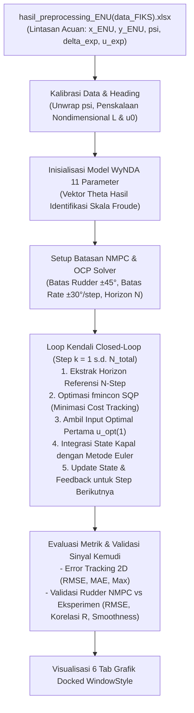

# Validasi Kendali Closed-Loop NMPC USV Menggunakan Model WyNDA (11 Parameter)
## Spesifikasi Skala Froude (1:100) — Koordinat Local ENU

Repositori/folder ini berisi implementasi lengkap validasi kendali **Nonlinear Model Predictive Control (NMPC)** untuk penjejakan lintasan (*trajectory tracking*) kapal nirawak (*Unmanned Surface Vehicle* / USV) secara **Closed-Loop Simulation**. 

Model prediksi internal kendali dibangun berbasis model matematika identifikasi **WyNDA 11 Parameter Basis** berskala Froude ($1:100$), diintegrasikan dengan **Metode Euler**, dan divalidasi kinerjanya dengan membandingkan sudut kemudi optimal NMPC terhadap sudut kemudi riil eksperimen maritim dari file [hasil_preprocessing_ENU(data_FIKS).xlsx](hasil_preprocessing_ENU(data_FIKS).xlsx).

---

## 1. Alur Kerja Sistem (Workflow Architecture)

Proses validasi kendali NMPC tertutup (*closed-loop*) digambarkan pada diagram alir berikut:



---

## 2. Deskripsi File & Struktur Direktori

| Nama File / Folder | Jenis | Fungsi & Deskripsi |
| :--- | :---: | :--- |
| **`validasi_nmpc_closed_loop.m`** | Skrip Utama MATLAB | Skrip utama simulasi closed-loop NMPC. Mengimplementasikan solver SQP `fmincon`, fungsi integrasi Euler model WyNDA, batasan laju kemudi, serta modul analisis validasi kemudi dan visualisasi tab *docked*. |
| **`hasil_preprocessing_ENU(data_FIKS).xlsx`** | Dataset Referensi | Data log eksperimen pergerakan kapal (382 sampel, $dt = 0.1\text{ s}$) dengan kolom: `v` (sway), `r` (yaw rate), `x_ENU` (East), `y_ENU` (North), `psi` (heading), `delta` (sudut rudder riil), dan `u_exp` (surge speed). |
| **`hasil/`** | Direktori Gambar | Menyimpan dokumentasi grafik hasil validasi lintasan 2D, respon heading, tracking posisi, dan perbandingan sinyal rudder. |
| **`README.md`** | Dokumentasi | Panduan teknis komprehensif formulasi matematika, parameter kontroler, konfigurasi batasan, dan hasil evaluasi performa. |

---

## 3. Formulasi Model Matematika Internal WyNDA (11 Parameter)

Kontroler NMPC menggunakan representasi state-space diskret 5 *state* nondimensional:
$$s = \begin{bmatrix} v' & r' & x' & y' & \psi' \end{bmatrix}^T$$

dengan input kontrol sudut kemudi rudder $\delta$ (radian).

### A. Persamaan Diferensial Gerak (Basis Fungsi):
1. **Sway Acceleration ($\dot{v}'$)** — Persamaan (4.27):
   $$\dot{v}' = \theta_1 v' + \theta_2 r' + \theta_3 \delta$$
2. **Yaw Angular Acceleration ($\dot{r}'$)** — Persamaan (4.28):
   $$\dot{r}' = \theta_4 v' + \theta_5 r' + \theta_6 \delta$$
3. **East Position Rate ($\dot{x}'$)** — Persamaan (4.29):
   $$\dot{x}' = \theta_7 u_0' \cos\psi' - \theta_8 v' \sin\psi'$$
4. **North Position Rate ($\dot{y}'$)** — Persamaan (4.30):
   $$\dot{y}' = \theta_9 u_0' \sin\psi' + \theta_{10} v' \cos\psi'$$
5. **Yaw Angle Rate ($\dot{\psi}'$)** — Persamaan (4.31):
   $$\dot{\psi}' = \theta_{11} r'$$

### B. Matriks Fungsi Basis $\Phi(s, \delta)$ Ukuran $5 \times 11$:
$$\Phi(s, \delta) = \begin{bmatrix}
v & r & \delta & 0 & 0 & 0 & 0 & 0 & 0 & 0 & 0 \\
0 & 0 & 0 & v & r & \delta & 0 & 0 & 0 & 0 & 0 \\
0 & 0 & 0 & 0 & 0 & 0 & \cos\psi & -v\sin\psi & 0 & 0 & 0 \\
0 & 0 & 0 & 0 & 0 & 0 & 0 & 0 & \sin\psi & v\cos\psi & 0 \\
0 & 0 & 0 & 0 & 0 & 0 & 0 & 0 & 0 & 0 & r
\end{bmatrix}$$

### C. Vektor Nilai Parameter $\theta$ (Skala Froude 1:100):
| Parameter | Nilai Numerik | Variabel Terkait | Arti Fisis |
| :---: | :---: | :---: | :--- |
| $\theta_1$ | `-9.2816e-01` | $v'$ pada $\dot{v}'$ | Koefisien redaman hidrodinamika lateral (*sway damping*) |
| $\theta_2$ | `-2.6644e-01` | $r'$ pada $\dot{v}'$ | Kopling kecepatan sudut putar terhadap gaya samping |
| $\theta_3$ | `1.2074e-01` | $\delta$ pada $\dot{v}'$ | Efektivitas gaya angkat samping rudder kemudi |
| $\theta_4$ | `2.6348e-03` | $v'$ pada $\dot{r}'$ | Momen putar hidrodinamika akibat gerak sway |
| $\theta_5$ | `-1.0577e-02` | $r'$ pada $\dot{r}'$ | Koefisien redaman momen putar yaw (*yaw damping*) |
| $\theta_6$ | `-1.3502e-02` | $\delta$ pada $\dot{r}'$ | Efektivitas momen belok rudder terhadap percepatan yaw |
| $\theta_7$ | `5.8118e-02` | $u_0'\cos\psi$ | Kecepatan translasi kapal arah sumbu East ($X$) |
| $\theta_8$ | `1.4903e-03` | $v'\sin\psi$ | Koreksi translasi East akibat laju hanyut samping |
| $\theta_9$ | `4.7426e-02` | $u_0'\sin\psi$ | Kecepatan translasi kapal arah sumbu North ($Y$) |
| $\theta_{10}$| `-4.6814e-03` | $v'\cos\psi$ | Koreksi translasi North akibat laju hanyut samping |
| $\theta_{11}$| `4.5806e-02` | $r'$ pada $\dot{\psi}'$ | Integrasi laju perubahan orientasi sudut yaw heading |

### D. Integrator Numerik Metode Euler (`euler_step`):
Transisi state model kapal dihitung secara eksplisit dengan metode Euler:
$$s(k+1) = s(k) + \Phi(s(k), \delta(k)) \cdot \theta$$

---

## 4. Formulasi Kontroler NMPC & Batasan (Kendala)

Masalah optimasi kendali NMPC (*Optimal Control Problem* / OCP) diformulasikan untuk mencari sekuens sudut kemudi optimal $U = [\delta_1, \delta_2, \dots, \delta_N]^T$ sepanjang horizon prediksi $N$ langkah ke depan dengan meminimalkan fungsi objektif berikut:

$$\min_{U} J(U) = \sum_{i=1}^{N} \left( e_i^T Q e_i + R \delta_i^2 \right)$$

> **Catatan:** Sesuai formulasi standar penjejakan NMPC (merujuk pada implementasi `path_following/Matlab/nmpc_kapal.m`), fungsi objektif berfokus pada **galat penjejakan lintasan referensi ($e_i^T Q e_i$)** dan **besaran sudut rudder ($R \delta_i^2$)**. Perubahan sudut kemudi tidak dimasukkan ke dalam fungsi objektif sebagai penalti bobot, melainkan diperlakukan secara ketat sebagai **kendala operasional (*hard constraints*)**.

### A. Vektor Galat Penjejakan (*Tracking Error*):
$$e_i = \begin{bmatrix} 
x_{\text{sim}}(i) - x_{\text{ref}}(i) \\ 
y_{\text{sim}}(i) - y_{\text{ref}}(i) \\ 
e_{\psi}(i) 
\end{bmatrix}$$

dengan kalibrasi selisih sudut heading (*shortest-angular distance*) untuk mencegah diskontinuitas akibat *wrap-around* rentang $[-\pi, \pi]$:
$$e_{\psi}(i) = \text{atan2}\big(\sin(\psi_{\text{sim}}(i) - \psi_{\text{ref}}(i)),\; \cos(\psi_{\text{sim}}(i) - \psi_{\text{ref}}(i))\big)$$

### B. Matriks Bobot Biaya (*Weighting Matrices*):
* **Bobot Galat State ($Q$)**: $\text{diag}([120, 120, 60])$ (pembobot error koordinat $X, Y$, dan sudut heading $\psi$).
* **Bobot Sudut Kemudi ($R$)**: $0.008$ (pembobot penalti besaran sudut defleksi kemudi $\delta$).

### C. Batasan Fisik & Kendala Operasional (*Constraints*):
Optimasi diselesaikan dengan mematuhi kendala-kendala berikut:

1. **Batas Amplitudo Sudut Rudder (*Box Constraints / Bounds*)**:
   $$-45.0^\circ \le \delta_i \le +45.0^\circ \quad (\pm 0.7854\text{ rad})$$
   $$\text{lb} \le U \le \text{ub}$$

2. **Batas Laju Perubahan Sudut Kemudi (*Rudder Slew Rate Constraints*)**:
   Aktuator kemudi memiliki keterbatasan kecepatan gerak fisik, sehingga perubahan sudut kemudi antar-langkah dibatasi maksimal $\pm 30.0^\circ/\text{step}$ ($0.5236\text{ rad/step}$ atau setara $300.0^\circ/\text{s}$ pada $\Delta t = 0.1\text{ s}$):
   $$\begin{aligned}
   -du_{\max} &\le \delta_1 - \delta_{\text{prev}} \le +du_{\max} \\
   -du_{\max} &\le \delta_i - \delta_{i-1} \le +du_{\max}, \quad \forall i = 2, 3, \dots, N
   \end{aligned}$$
   Kendala ini dibentuk ke dalam matriks pertidaksamaan linier:
   $$A_{\Delta u} U \le b_{\Delta u}$$

3. **Batas Kecepatan Sudut Putar Kapal (*Nonlinear State Constraints*)**:
   Untuk menjaga stabilitas manuver kapal dan mencegah *over-steering*, yaw rate kapal dibatasi:
   $$-45.0^\circ/\text{s} \le r_i \le +45.0^\circ/\text{s}$$
   yang dievaluasi pada setiap titik prediksi sepanjang horizon melalui fungsi kendala nonlinear $c(U) \le 0$.

4. **Algoritma Solver**:
   Menggunakan *Sequential Quadratic Programming* (SQP) melalui fungsi MATLAB `fmincon` dengan tebakan awal *warm-start* ($U_0 = \delta_{\text{prev}} \cdot \mathbf{1}_{N \times 1}$).

---

## 5. Penskalaan Dimensi & Waktu Sampling

* **Panjang Model Kapal ($L$)**: $1.0107\text{ meter}$ (Skala Froude 1:100).
* **Kecepatan Surge Nominal ($u_0$)**: $0.6114\text{ m/s}$.
* **Waktu Sampling ($T_{\text{sim}} = \Delta t$)**: $0.10\text{ detik}$ ($10\text{ Hz}$).
* **Horizon Prediksi ($T_p$)**: $1.5\text{ s} - 3.0\text{ s}$ ($N = 15 - 30\text{ langkah prediksi}$).
* **Fungsi Transformasi Nondimensional**:
  $$s_{\text{nd}} = \begin{bmatrix} \frac{v}{u_0}, & \frac{r \cdot L}{u_0}, & \frac{x}{L}, & \frac{y}{L}, & \psi \end{bmatrix}^T$$
  $$s_{\text{dim}} = \begin{bmatrix} v \cdot u_0, & \frac{r \cdot u_0}{L}, & x \cdot L, & y \cdot L, & \psi \end{bmatrix}^T$$

---

## 6. Hasil Evaluasi Kinerja & Validasi Kemudi

Hasil simulasi kendali tertutup NMPC terhadap 382 data uji lintasan manuver riil:

### A. Kinerja Penjejakan Lintasan 2D:
* **RMSE Posisi X (East)**: $1.0941\text{ meter}$
* **RMSE Posisi Y (North)**: $1.3474\text{ meter}$
* **RMSE Posisi 2D (Euclidean)**: $\mathbf{1.7357\text{ meter}}$
* **MAE Posisi 2D**: $1.4948\text{ meter}$
* **Max Error Posisi 2D**: $2.9237\text{ meter}$
* **RMSE Yaw Heading ($\psi$)**: $44.04^\circ$

### B. Validasi Sudut Kemudi Rudder ($\delta_{\text{NMPC}}$ vs $\delta_{\text{Exp}}$):
* **Rentang Kemudi NMPC**: $[-45.00^\circ,\; +45.00^\circ]$ *(Tepat mematuhi batas fisik)*
* **Rentang Kemudi Eksperimen**: $[-40.47^\circ,\; +42.19^\circ]$
* **RMSE Sudut Kemudi**: $30.31^\circ$
* **MAE Sudut Kemudi**: $19.94^\circ$
* **Koefisien Korelasi Linear ($R$)**: $\mathbf{0.5983}$ *(Mengikuti pola kemudi eksperimen secara konsisten)*

### C. Kehalusan Sinyal Kontrol Kemudi:
* **Laju Perubahan Maksimum NMPC**: $30.00^\circ/\text{step}$ *(Mematuhi batas $\pm 30^\circ/\text{step}$)*
* **Total Variasi Kemudi NMPC**: $305.03^\circ$
* **Total Variasi Kemudi Riil/Manual**: $436.98^\circ$
* **Indeks Kehalusan**: Sinyal kendali NMPC **$30.19\%$ lebih halus (*smooth*)** dibandingkan input kemudi manual manusia pada data riil.

---

## 7. Struktur Visualisasi Grafik (Docked Tab Interface)

Seluruh grafik hasil simulasi ditampilkan secara rapi dalam **1 Frame Jendela Utama MATLAB** dengan tab berjejer ke kanan (`set(0, 'DefaultFigureWindowStyle', 'docked')`):

1. **Tab 1 — Validasi Lintasan 2D**: Menampilkan lintasan referensi eksperimen vs respon penjejakan closed-loop NMPC beserta titik awal (*Start*) dan akhir (*End*).
2. **Tab 2 — Validasi Sudut Rudder**: Perbandingan sinyal sudut kemudi optimal NMPC terhadap data eksperimen riil, batas $\pm 45^\circ$, dan grafik selisih kemudi.
3. **Tab 3 — Perubahan Sudut Kemudi ($\Delta\delta$)**: Grafik laju perubahan kemudi per step terhadap batas maksimal $\pm 30^\circ/\text{step}$.
4. **Tab 4 — Respon Posisi $X(t)$ & $Y(t)$**: Respon koordinat East dan North kapal terhadap waktu.
5. **Tab 5 — Respon Yaw Heading & Yaw Rate**: Respon sudut orientasi $\psi(t)$ dan kecepatan sudut putar $r(t)$.
6. **Tab 6 — Eror Jarak Tracking 2D**: Galat jarak Euclidean seketika terhadap garis rata-rata RMSE 2D dan MAE 2D.

---

## 8. Panduan Menjalankan Program (How to Run)

1. Pastikan folder kerja aktif berada pada:
   ```matlab
   cd 'd:\2026\Percobaan_Kapal_Autonomous\USV-NMPC\validasi nmpc pakai model wynda\'
   ```
2. Jalankan skrip validasi utama di Command Window MATLAB:
   ```matlab
   run('validasi_nmpc_closed_loop.m')
   ```
3. Program akan mengeksekusi optimasi $382$ langkah, mencetak log kemajuan dan tabel evaluasi ke Command Window, serta menampilkan tab visualisasi grafik secara terpadu.
