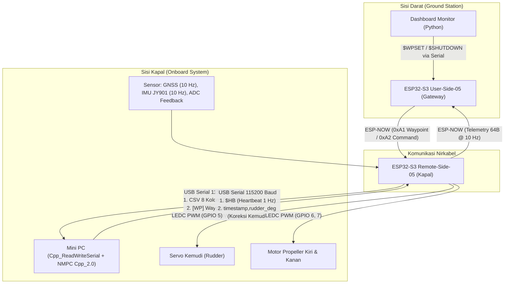

# Roadmap & To-Do List Implementasi NMPC Autonomous Ship (USV) C++

Dokumen ini berisi panduan komprehensif, arsitektur teknis, dan daftar tugas (*to-do list*) bertahap untuk memodifikasi program serial C++ (`Cpp_ReadWriteSerial-1.0`) agar terintegrasi penuh dengan kendali **Nonlinear Model Predictive Control (NMPC)** untuk pelacakan waypoint (*waypoint tracking*) kapal nirawak (USV).

---

## 1. Arsitektur Sistem & Alur Data



---

## 2. Pemetaan Variabel & Model Matematika

### A. Model WyNDA 11 Parameter Basis (Skala Froude 1:100)
- **Panjang Kapal ($L$):** $1.0107\text{ m}$
- **Kecepatan Surge Nominal ($u_0$):** $0.6114\text{ m/s}$
- **State Vektor Non-Dimensional ($s$):**
  $$s = \begin{bmatrix} v' \\ r' \\ x' \\ y' \\ \psi \end{bmatrix} = \begin{bmatrix} v / u_0 \\ r \cdot (L / u_0) \\ X_{\text{ENU}} / L \\ Y_{\text{ENU}} / L \\ \psi_{\text{ENU}} \end{bmatrix}$$
- **Vektor Parameter $\theta$ (11 Elemen):**
  - $\theta_1 = -0.92816$ ($v$ pada $\dot{v}$)
  - $\theta_2 = -0.26644$ ($r$ pada $\dot{v}$)
  - $\theta_3 = 0.12074$ ($\delta$ pada $\dot{v}$)
  - $\theta_4 = 0.0026348$ ($v$ pada $\dot{r}$)
  - $\theta_5 = -0.010577$ ($r$ pada $\dot{r}$)
  - $\theta_6 = -0.013502$ ($\delta$ pada $\dot{r}$)
  - $\theta_7 = 0.058118$ ($u_0 \cos\psi$)
  - $\theta_8 = 0.0014903$ ($v \sin\psi$)
  - $\theta_9 = 0.047426$ ($u_0 \sin\psi$)
  - $\theta_{10} = -0.0046814$ ($v \cos\psi$)
  - $\theta_{11} = 0.045806$ ($r$ pada $\dot{\psi}$)

### B. Konfigurasi NMPC
- **Horizon Prediksi ($N$):** 20 step ($2.0\text{ detik}$ pada sampling $T_s = 0.1\text{ s} / 10\text{ Hz}$).
- **Bobot Biaya ($Q, R$):** $Q = \text{diag}([10, 10, 10])$ untuk $[x_{\text{err}}, y_{\text{err}}, \psi_{\text{err}}]$, $R = 1.0$ (penalti kemudi).
- **Batasan Kemudi ($u_{\text{limit}}$):** $\pm 45^\circ$ ($\pm 0.7854\text{ rad}$).
- **Laju Perubahan Kemudi ($\Delta u_{\text{max}}$):** $\pm 30^\circ/\text{step}$ ($\pm 0.5236\text{ rad/step}$).
- **Batasan Yaw Rate ($r_{\text{limit}}$):** $\pm 45^\circ/\text{s}$ non-dimensional.
- **Radius Transisi Waypoint ($r_{\text{tran}}$):** $3.0\text{ meter}$.

---

## 3. Rencana Kerja & To-Do List Terstruktur

### Tahap 1: Struktur Proyek & Integrasi Library C++ NMPC
Menggabungkan kode hasil generate MATLAB Coder (`codegen/lib/nmpc_kapal_waypoint`) ke dalam build system C++ (`CMakeLists.txt`).

- [x] **1.1. Organisasi Direktori & File Header**
  - [x] Buat struktur folder modular di `CPP_Gabungan` (`include/`, `src/`, `nmpc/`, `tests/`).
  - [x] Pindahkan/tautkan 58 file `.cpp` dan 66 file `.h` codegen dari `USV-NMPC/waypoint/Cpp_2.0/codegen1/lib/nmpc_kapal_waypoint/` ke dalam build tree proyek C++ (`CPP_Gabungan/nmpc/`).
  - [x] Pastikan file inti `nmpc_kapal_waypoint.h`, `nmpc_kapal_waypoint_initialize.h`, `nmpc_kapal_waypoint_terminate.h` dan file pendukung QP/SQP solver dapat diakses oleh include path.
- [x] **1.2. Konfigurasi CMakeLists.txt**
  - [x] Update `CMakeLists.txt` untuk mengompilasi semua file `.cpp` codegen NMPC menjadi static library `libnmpc_solver.a`.
  - [x] Tambahkan optimasi kompilasi (`-O3` pada GCC/MinGW) dan OpenMP (`-fopenmp`) untuk performa maksimal.
  - [x] Verifikasi proses build berhasil 100% tanpa warning kritis atau unresolved symbols.
- [x] **1.3. Uji Coba Unit Test Standalone NMPC di C++**
  - [x] Buat file tes `tests/test_nmpc.cpp` yang memanggil `nmpc_kapal_waypoint()` dengan kondisi uji manuver.
  - [x] Verifikasi output `u_opt` dan `exitflag` identik dengan hasil perhitungan MATLAB (`exitflag = 1`, `u_opt = 17.05 deg`).
  - [x] Ukur waktu eksekusi (*computation time*) per step (rata-rata: **0.82 ms/step**, target $< 100\text{ ms}$ tercapai dengan margin 99.18%).

---

### Tahap 2: Manajemen Waypoint & Transformasi Koordinat (Guidance Module)
Membangun modul panduan navigasi (*guidance*) yang menerima data waypoint dari ESP32, melakukan konversi koordinat Geografis (Lat/Lon) $\rightarrow$ ENU (Meter), konversi posisi kapal saat ini (real-time GPS) $\rightarrow$ ENU, dan menghasilkan lintasan referensi horizon NMPC.

- [x] **2.1. Parser Waypoint dari Serial Stream (`[WP]` Tag)**
  - [x] Implementasikan parser di C++ (`GuidanceModule::parse_waypoint_line`) untuk membaca format tag `[WP]` dari serial ESP32:
    - Header: `[WP] msg_type=0xA1 home_valid=1 count=N`
    - Home coordinate: `[WP] Home: <lat>, <lon>`
    - Waypoint list: `[WP] #1: <lat>, <lon>`, ..., `[WP] #N: <lat>, <lon>`
  - [x] Simpan daftar waypoint ke dalam `std::vector<GeoPoint>` dan `std::vector<ENUPoint>` secara dinamis.
  - [x] Sediakan antarmuka manual/programatik (`set_home_point`, `add_waypoint_geo`, `set_waypoints_geo`) sebagai opsi fallback.
- [x] **2.2. Modul Proyeksi Koordinat Geodetik ke ENU (East-North-Up)**
  - [x] Implementasikan fungsi konversi WGS84 Geodetic $\rightarrow$ ENU planar meter dengan titik acuan Home Point $(\text{lat}_0, \text{lon}_0)$:
    $$y_{\text{north}} = R_{\text{earth}} \cdot (\text{lat} - \text{lat}_0) \cdot \frac{\pi}{180}$$
    $$x_{\text{east}} = R_{\text{earth}} \cdot \cos\left(\text{lat}_0 \cdot \frac{\pi}{180}\right) \cdot (\text{lon} - \text{lon}_0) \cdot \frac{\pi}{180}$$
    *(di mana $R_{\text{earth}} = 6,371,000\text{ m}$)*.
  - [x] Konversi seluruh sekuens waypoint menjadi koordinat $(X_{\text{ENU}}, Y_{\text{ENU}})$.
  - [x] Konversi posisi kapal saat ini (dari telemetri GPS `lat`, `lon` real-time) menjadi posisi kapal dalam ENU $(X_{\text{ship}}, Y_{\text{ship}})$ melalui `gps_to_enu()` dan `update_guidance_gps()`.
- [x] **2.3. Logika Switching Waypoint ($r_{\text{tran}}$)**
  - [x] Hitung jarak Euclidean real-time ke waypoint aktif:
    $$d_{\text{wp}} = \sqrt{(X_{\text{target}} - X_{\text{ship}})^2 + (Y_{\text{target}} - Y_{\text{ship}})^2}$$
  - [x] Logika pergantian target: Jika $d_{\text{wp}} \le r_{\text{tran}}$ ($3.0\text{ m}$) dan belum mencapai waypoint terakhir, otomatis naikkan `active_wp_index`.
  - [x] Tangani kondisi saat kapal mencapai waypoint terakhir (`is_mission_completed = true`).
- [x] **2.4. Generator Sekuens Referensi Horizon ($N = 20$)**
  - [x] Hitung sudut target heading line-of-sight:
    $$\theta_{\text{target}} = \text{atan2}(Y_{\text{target}} - Y_{\text{ship}}, X_{\text{target}} - X_{\text{ship}})$$
  - [x] Bangun array referensi untuk N langkah ke depan ($h = 1 \dots 20$):
    $$x_{\text{ref\_seq}}[h-1] = \frac{X_{\text{ship}} + h \cdot u_0 \cdot T_s \cdot \cos(\theta_{\text{target}})}{L}$$
    $$y_{\text{ref\_seq}}[h-1] = \frac{Y_{\text{ship}} + h \cdot u_0 \cdot T_s \cdot \sin(\theta_{\text{target}})}{L}$$
    $$\psi_{\text{ref\_seq}}[h-1] = \theta_{\text{target}}$$

---

### Tahap 3: Pembentukan State Kapal & Sinkronisasi Orientasi IMU
Menyusun state estimasi dari data telemetri serial ESP32-S3 dan menyelaraskan konvensi sudut kemudi dan heading (termasuk kalibrasi yaw kapal $+180^\circ$).

- [x] **3.1. Parsing Telemetri Serial 8-Kolom @ 10 Hz**
  - [x] Baca dan parse stream CSV dari `Remote-Side-05` via `telemetry_parser.hpp`:
    `timestamp, lat, lon, calc_deg_servo_1, calc_deg_servo_2, yaw, gyro_z, yaw_rate`
  - [x] Ekstrak posisi real-time kapal $(X_{\text{ship}}, Y_{\text{ship}})$ relatif terhadap Home Point.
- [x] **3.2. Penyelarasan Konvensi Sudut (Heading IMU $\leftrightarrow$ ENU $\psi$)**
  - [x] Implementasikan kalibrasi offset yaw $+180^\circ$ sesuai validasi aktual kapal:
    $$\text{yaw}_{\text{cal}} = (\text{yaw}_{\text{raw}} + 180^\circ) \pmod{360^\circ}$$
  - [x] Sinkronkan arah sudut terhadap sistem koordinat ENU ($0\text{ rad} = \text{East/Timur}$, $+\pi/2\text{ rad} = \text{North/Utara}$, counter-clockwise) agar sesuai dengan formulasi `atan2(dY, dX)` pada model WyNDA.
  - [x] Lakukan unwrap / shortest angular distance wrapping untuk menghindari diskontinuitas sudut $\pm\pi$ (`wrap_to_pi`).
- [x] **3.3. Estimasi State Vektor Non-Dimensional ($5 \times 1$)**
  - [x] Bentuk `current_state_nd[5]` di `StateObserver::update()`:
    - `s[0]` = $v' = v_{\text{sway}} / u_0 = 0.0$.
    - `s[1]` = $r' = (\text{yaw\_rate}_{\text{dps}} \cdot \frac{\pi}{180}) \cdot \frac{L}{u_0}$.
    - `s[2]` = $x' = X_{\text{ship}} / L$.
    - `s[3]` = $y' = Y_{\text{ship}} / L$.
    - `s[4]` = $\psi = \text{Heading}_{\text{ENU}}\text{ (radian)}$.
  - [x] Rekam nilai kemudi aktual dari potensiometer (`calc_deg_servo_1`) dan kemudi sebelumnya $u_{\text{prev}}$.

---

### Tahap 4: Modifikasi Loop Utama `Cpp_ReadWriteSerial-1.0`
Mengintegrasikan seluruh pipeline ke dalam program eksekutabel utama yang berjalan di Mini PC.

- [x] **4.1. Pembaruan CLI Parameter & Mode Operasi**
  - [x] Tambahkan mode kendali baru pada argumen CLI `--rudder-mode`:
    - `nmpc` : Menggunakan Nonlinear MPC Waypoint Tracking (Mode Riset Utama - Default).
    - `zero` / `yawrate2` / `demo` : Mode uji coba/fallback bawaan.
  - [x] Tambahkan argumen konfigurasi NMPC via CLI:
    - `--yaw-offset <deg>` (default: 180.0 deg)
    - `--r-tran <meter>` (default: 3.0 m)
    - `--surge-speed <m/s>` (default: 0.6114 m/s)
    - `--ship-length <meter>` (default: 1.0107 m)
    - `--home <lat,lon>` (override manual titik acuan Home)
    - `--add-wp <lat,lon>` (tambah manual koordinat waypoint)
    - `--default-test-wp` (muat koordinat uji kolam dari `run_nmpc.m`)
- [x] **4.2. Eksekusi Solver NMPC & Komputasi Sinyal Kendali**
  - [x] Inisialisasi: Panggil `nmpc_kapal_waypoint_initialize()` sebelum loop utama dimulai.
  - [x] Di dalam loop pembacaan data serial (saat baris telemetri CSV valid diterima):
    1. Update posisi kapal di koordinat ENU & kalibrasi yaw $+180^\circ$ via `StateObserver`.
    2. Cek radius $r_{\text{tran}}$ dan tentukan waypoint target aktif via `GuidanceModule`.
    3. Generate sekuens horizon $x_{\text{ref}}, y_{\text{ref}}, \psi_{\text{ref}}$.
    4. Panggil solver C++:
       ```cpp
       nmpc_kapal_waypoint(current_state_nd, u_prev_rad, u_0, 
                           x_ref_seq, y_ref_seq, psi_ref_seq, 
                           &u_opt_rad, &exitflag);
       ```
    5. Evaluasi `exitflag`:
       - Jika `exitflag > 0`: konversi kemudi ke derajat $\delta_{\text{deg}} = u_{\text{opt}} \cdot \frac{180}{\pi}$.
       - Jika `exitflag <= 0` (gagal konvergen / timeout): gunakan $u_{\text{prev}}$ atau kemudi netral $0^\circ$ sebagai mekanisme keamanan (*fail-safe*).
    6. Batasi sudut kemudi fisik (*clamping*): $\delta_{\text{deg}} = \text{clamp}(\delta_{\text{deg}}, -35.0^\circ, +35.0^\circ)$.
    7. Kirim perintah kemudi balik ke ESP32 melalui Serial:
       ```text
       <timestamp>,<rudder_deg>
       Contoh: 142.583,-12.45
       ```
    8. Update $u_{\text{prev\_rad}} = u_{\text{opt\_rad}}$.
  - [x] Terminasi: Panggil `nmpc_kapal_waypoint_terminate()` saat program menerima sinyal SIGINT/shutdown.
- [x] **4.3. Menjaga Heartbeat `$HB` & Forwarding `$SHUTDOWN`**
  - [x] Pastikan pengiriman `$HB` (1 Hz) tetap berjalan secara non-blocking.
  - [x] Pastikan penanganan `$SHUTDOWN` tetap aman mematikan Mini PC saat diperintahkan dari darat.

---

### Tahap 5: Logging Data Penelitian & Visualisasi Real-Time
Menyediakan fasilitas perekaman data telemetri + kendali lengkap untuk keperluan analisis hasil riset, jurnal, atau skripsi/tesis.

- [ ] **5.1. CSV Logger Komprehensif (Data Riset)**
  - [ ] Buat file log otomatis di folder `logs/` dengan format nama `nmpc_log_YYYYMMDD_HHMMSS.csv`.
  - [ ] Rekam parameter setiap step (10 Hz):
    - `timestamp`: Waktu eksperimen (detik)
    - `lat_raw, lon_raw`: Posisi GPS
    - `x_enu, y_enu`: Posisi kapal dalam meter ENU
    - `yaw_deg, yaw_rate_dps`: Respon dinamika kapal
    - `active_wp_idx, wp_target_x, wp_target_y`: Status waypoint
    - `dist_to_wp, theta_target_deg`: Jarak dan sudut pandang target
    - `heading_error_deg, cross_track_error_m`: Error pelacakan
    - `rudder_cmd_deg, feedback_servo_deg`: Sinyal kendali & aktuasi
    - `nmpc_solve_time_ms, exitflag`: Metrik performa komputasi
- [ ] **5.2. Tampilan Status Console Real-Time**
  - [ ] Tampilkan ringkasan status di terminal (Opsional: dashboard ANSI interaktif):
    ```text
    [NMPC RUN] t=45.2s | Pos: (X: 12.4m, Y: 28.1m) | WP #2/4 (Dist: 8.3m)
               Yaw: 42.1° -> Target: 45.0° (Err: +2.9°)
               Rudder Cmd: -4.82° | Solver: OK (exitflag=1, 8.4 ms)
    ```

---

### Tahap 6: Pengujian, Simulasi, & Validasi Lapangan

- [ ] **6.1. Pengujian Software-in-the-Loop (SITL / Loopback Serial)**
  - [ ] Buat skrip simulasi pemutar data log (*playback simulator*) atau virtual serial port (com0com).
  - [ ] Kirim telemetri kapal simulasi ke program C++ NMPC, verifikasi bahwa sinyal kemudi C++ merespons ke arah yang benar.
  - [ ] Bandingkan trajektori yang dihasilkan C++ dengan hasil simulasi MATLAB `run_nmpc.m`.
- [ ] **6.2. Pengujian Hardware-in-the-Loop (HIL) di Darat / Meja Uji**
  - [ ] Hubungkan Mini PC ke ESP32-S3 Remote-Side via USB kabel.
  - [ ] Nyalakan RC Transmitter, ubah CH6 ke Auto Mode ($\ge 1750$).
  - [ ] Kirim waypoint dari Dashboard darat via ESP-NOW $\rightarrow$ periksa apakah Mini PC menerima dan mengenali titik target.
  - [ ] Gerakkan sensor IMU secara manual, pastikan servo kemudi merespons dengan polaritas yang tepat (menolak heading error).
- [ ] **6.3. Uji Coba Lapangan di Kolam/Danau (Water Trial)**
  - [ ] Kalibrasi titik awal (Home Point) dan pastikan GPS mendapatkan 3D Fix yang akurat.
  - [ ] Kirim misi 4 Waypoint dari Dashboard.
  - [ ] Aktifkan mode Auto pada RC.
  - [ ] Amati kemampuan pelacakan lintasan kapal, stabilitas sudut kemudi, dan transisi antar-waypoint.
  - [ ] Ekstrak file CSV log dan buat plot performa (Trajektori ENU, Lat/Lon, Heading vs Target, dan Sudut Rudder).

---

## 4. Checklist Progres Pengerjaan

| Modul / Komponen | Target File | Status | Keterangan |
|---|---|:---:|---|
| **Integrasi Codegen C++** | `CMakeLists.txt`, `nmpc/libnmpc_solver.a` | ✅ Selesai | Terkompilasi 100%, avg 0.82 ms/step |
| **Transformasi Geodetik ENU** | `include/guidance.hpp`, `src/guidance.cpp` | ✅ Selesai | Konversi Home, WP, & Kapal GPS $\rightarrow$ ENU |
| **Parser Waypoint Serial** | `include/guidance.hpp` (`parse_waypoint_line`) | ✅ Selesai | Parsing tag `[WP]` dari ESP32 stream |
| **State Observer & Kalibrasi IMU** | `include/state_observer.hpp`, `src/state_observer.cpp` | ✅ Selesai | Kalibrasi Yaw $+180^\circ$ \& State Non-Dim $[v',r',x',y',\psi']$ |
| **Loop Kendali Utama** | `src/main.cpp` (`read_write_serial.exe`) | ✅ Selesai | Mode `--rudder-mode nmpc` 10 Hz + Fail-safe |
| **Data Logging CSV** | `include/data_logger.hpp` | ⏳ Pending | Perekaman 10 Hz untuk analisis jurnal/skripsi |
| **Validasi SITL / Simulasi** | `test_nmpc_sim.cpp` | ⏳ Pending | Uji komparasi MATLAB vs C++ |
| **Uji Coba Lapangan (USV)** | Hardware ESP32-S3 + Mini PC | ⏳ Pending | Pengujian water trial di kolam uji |

---

*Catatan: Dokumen ini dirancang sebagai panduan kerja komprehensif bagi penelitian autonomous surface vessel (USV). Setiap tahapan dapat diperbarui seiring kemajuan eksperimen.*
